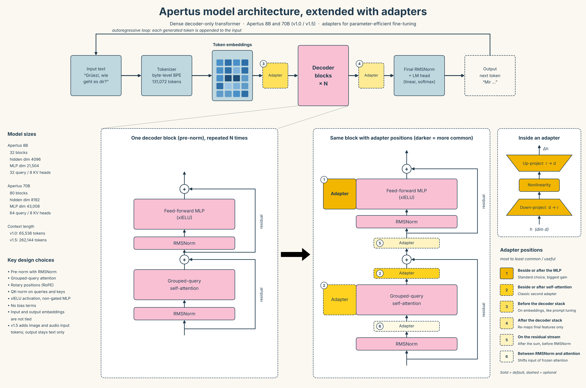

# Apertus architecture and adapter positions

Apertus is a fully open, multilingual LLM from EPFL, ETH Zurich and CSCS. It is a dense, decoder-only transformer released in two sizes, 8B and 70B.



## Pipeline

1. **Tokenizer**: byte-level BPE with a 131,072-token vocabulary.
2. **Token embeddings**: map each token to a vector (input and output embeddings are not tied).
3. **Decoder blocks × N**: the core of the model (32 blocks in 8B, 80 in 70B).
4. **Final RMSNorm + LM head**: turns the last hidden state into next-token probabilities.
5. **Autoregressive loop**: each generated token is appended to the input.

## Decoder block

Each block is pre-norm and has two sublayers, each wrapped in a residual connection:

- **RMSNorm → grouped-query self-attention**: causal attention with rotary positions (RoPE) and QK-norm; fewer key/value heads than query heads.
- **RMSNorm → feed-forward MLP**: non-gated MLP with the xIELU activation.

No bias terms are used anywhere.

| | Blocks | Hidden dim | MLP dim | Heads (query / KV) |
|---|---|---|---|---|
| Apertus 8B | 32 | 4096 | 21,504 | 32 / 8 |
| Apertus 70B | 80 | 8192 | 43,008 | 64 / 8 |

Context length is 65,536 tokens in v1.0 and 262,144 in v1.5. Version 1.5 also accepts image and audio tokens as input; output stays text only.

## Adapters

An adapter is a small trainable bottleneck (down-projection, nonlinearity, up-projection) added to the frozen model. Only the adapter weights are trained.

Positions in the figure, from most to least common:

1. Beside or after the feed-forward MLP (standard choice)
2. Beside or after self-attention, before the residual sum
3. Before the decoder stack, on the embeddings
4. After the decoder stack, before the final RMSNorm
5. On the residual stream, after the sum
6. Between RMSNorm and self-attention

Ranks 1 and 2 follow published adapter comparisons; the order of 3 to 6 is a judgement call and was not benchmarked on Apertus.

## Training adapters: `apertus_adapters.py`

A standalone script that attaches bottleneck adapters to Apertus and trains them. It does not use PEFT or the official fine-tuning recipes.

**Requirements:** `pip install torch "transformers>=4.56"` (plus `bitsandbytes` for `--four-bit`).

**1. Check that adapters can be attached**

```bash
python apertus_adapters.py check --model swiss-ai/Apertus-8B-Instruct-2509
```

Prints one decoder block, verifies every block has the expected parts (`self_attn`, `mlp`, `attention_layernorm`, `feedforward_layernorm`), attaches the adapters and confirms the model output is unchanged before training.

**2. Train**

```bash
python apertus_adapters.py train --data merges.jsonl --out merge_adapters.pt
```

The data file has one chat-format example per line:

```json
{"messages": [{"role": "user", "content": "<file with conflict markers>"},
              {"role": "assistant", "content": "<resolved file>"}]}
```

The base model is frozen; only the adapters are trained and saved.

**3. Use the trained adapters**

```python
from apertus_adapters import load_model, load_adapters
tok, model = load_model("swiss-ai/Apertus-8B-Instruct-2509")
load_adapters(model, "merge_adapters.pt")
```

**Options**

| Flag | Default | Meaning |
|---|---|---|
| `--positions` | `mlp` | Where to attach: any combination of the names in the table below |
| `--rank` | 64 | Bottleneck width `r` of each adapter |
| `--four-bit` | off | Load the base model in 4-bit to save GPU memory |
| `--max-len` | 8192 | Longest example in tokens (train only) |
| `--lr`, `--epochs`, `--accum` | 1e-4, 1, 8 | Learning rate, passes over the data, gradient accumulation steps |

**Positions** (for example `--positions mlp attention`)

| Name | Figure | Where |
|---|---|---|
| `mlp` | 1 | Parallel to the feed-forward MLP |
| `attention` | 2 | Parallel to self-attention |
| `embed` | 3 | After the token embeddings |
| `final` | 4 | Before the final RMSNorm |
| `residual` | 5 | On the residual stream, after the attention sum |
| `pre_attention` | 6 | Between RMSNorm and self-attention |

**Status:** tested on a small random Apertus model only (attach at all six positions, train, save, reload). It has not been run on the real 8B weights, and the `--four-bit` path is untested. The training loop is minimal: one example at a time, loss on the whole conversation.

## Files

| File | Purpose |
|---|---|
| `apertus_adapters.py` | Checks the architecture, attaches adapters, trains and saves them |
| `sweep_adapters.py` | Tests combinations of adapter positions, ranks and learning rates |
| `apertus_architecture_adapters.png` | The figure above |

## Testing adapter combinations: `sweep_adapters.py`

`sweep_adapters.py` trains each combination on `--train`, measures the loss on `--val` (lower is better), and writes one row per run to `sweep_results.csv`. The model is loaded once, and a restarted sweep skips runs already in the CSV.

```bash
# All 63 combinations of the six positions
python sweep_adapters.py --train train.jsonl --val val.jsonl

# Only single positions and pairs (21 runs)
python sweep_adapters.py --train train.jsonl --val val.jsonl --max-size 2

# Three positions, two ranks, two learning rates (7 x 2 x 2 = 28 runs)
python sweep_adapters.py --train train.jsonl --val val.jsonl \
    --positions mlp attention embed --ranks 16 64 --lrs 1e-4 3e-4
```

The first CSV row is the base model without adapters, as a baseline. Like the training script, the sweep was tested on a small random Apertus model only.

## Next Steps
1. Train and compare adapters in Python: Run the sweep to find out whether adapters help on your merge task and which positions matter. Until you know that, porting is wasted work.
2. Clone and adapt code: Add winning adapter config to vLLM's ApertusDecoderLayer (https://github.com/vllm-project/vllm/blob/main/vllm/model_executor/models/apertus.py).
3. Port only the winning configuration.
4. Check the port against Python: Feed the same prompt to both and confirm the outputs match, because vLLM wires the norm and residual differently and a silent mismatch is easy to introduce.

## Sources

- [Apertus v1 technical report (arXiv 2509.14233)](https://arxiv.org/abs/2509.14233)
- [Apertus v1.5 model card](https://huggingface.co/swiss-ai/Apertus-v1.5-70B)
- [Code: github.com/swiss-ai](https://github.com/swiss-ai)
- [Apertus model code in Transformers](https://github.com/huggingface/transformers/blob/main/src/transformers/models/apertus/modeling_apertus.py)
- [Apertus model code in Transformers](https://github.com/huggingface/transformers/blob/main/src/transformers/models/apertus/modeling_apertus.py)
- [Official fine-tuning recipes](https://github.com/swiss-ai/apertus-finetuning-recipes)
